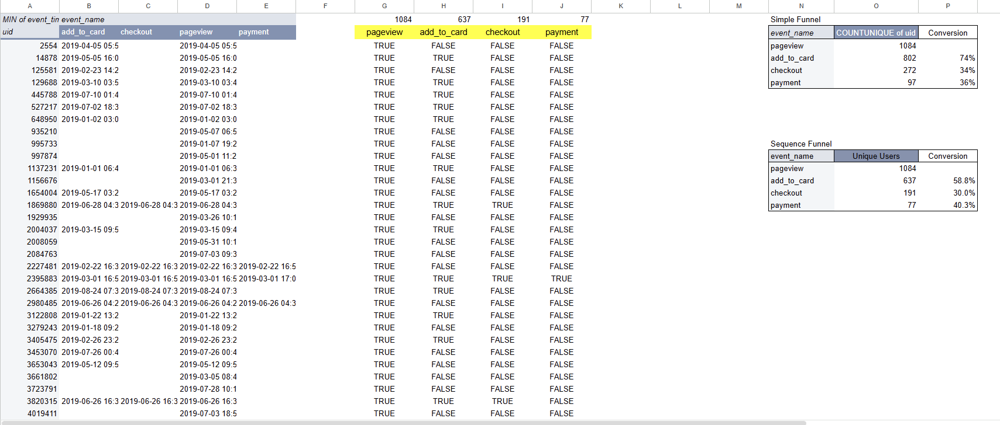

# Data Analytics Portfolio

This repository showcases data analytics projects focused on solving business problems through **data analysis, visualization, and user behavior insights**.

The projects demonstrate experience in:

* Product analytics
* Funnel analysis
* Retention analysis
* Data visualization and dashboards

Tools used include **SQL, Excel, Power BI, and Tableau**.

---

# Projects

## 📊 Customer Retention Cohort Analysis (Power BI)

[View Project →](powerbi-customer-retention-analysis)

Analyzed customer retention trends using **cohort analysis** to identify churn patterns and opportunities to improve long-term engagement.

**Key Focus**

* Cohort retention analysis
* Customer lifecycle insights
* Interactive Power BI dashboard

---

## 📈 Product Funnel Sequence Analysis

[View Project →](product-funnel-sequence-analysis)

Analyzed user behavior across a purchase funnel using **event-level data**.
Compared **Simple Funnel calculations** with **Sequence Funnel logic** to measure true user progression through the product journey.

**Key Focus**

* Product funnel analysis
* Event sequence validation
* Conversion drop-off analysis
* User behavior insights

---

## 📉 Superstore Returns Analysis (Tableau)

[View Project →](superstore-returns-analysis-tableau)

Explored the root causes of product returns and built an **interactive Tableau dashboard** to identify patterns across product categories, regions, and time.

**Key Focus**

* Return rate analysis
* Geographic insights
* Interactive data storytelling dashboard

---

# Tools & Skills

**Data Analysis**

* SQL
* Excel / Google Sheets
* Pivot tables
* Data exploration

**Data Visualization**

* Power BI
* Tableau
* Dashboard design

**Analytics Methods**

* Funnel analysis
* Cohort analysis
* Conversion analysis
* Business insight generation

